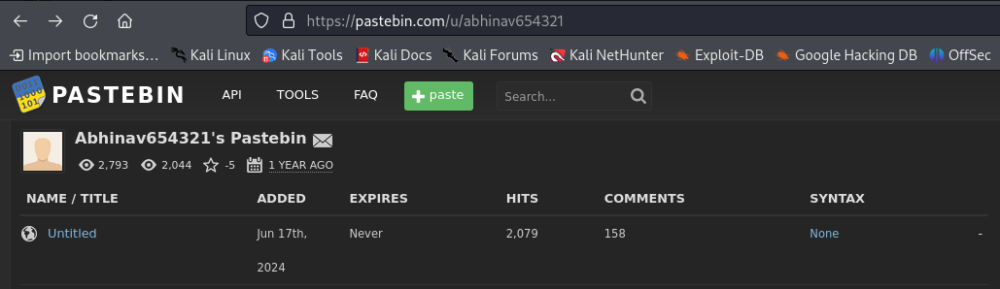
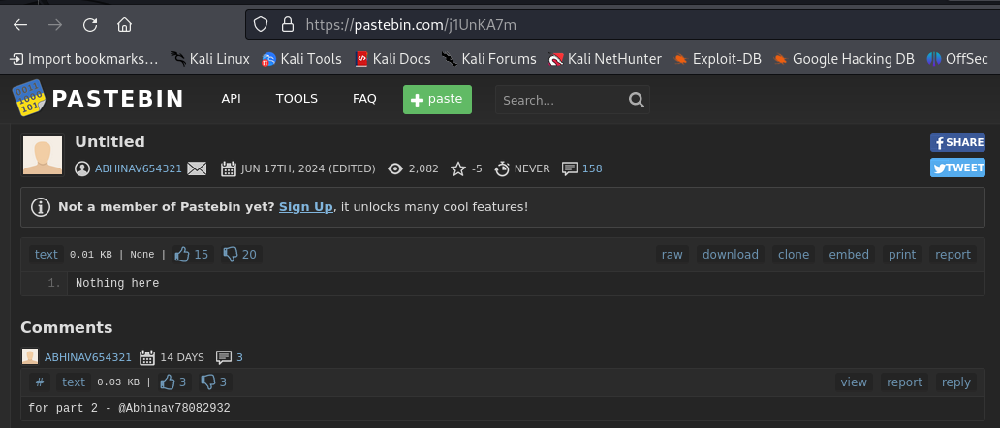

## Pastebin

* **Description:** 
	Just go to my pastebin which was created long time back. 
	**Important!** 
	There have been some changes to this challenge due things outside our control (**like deletion of the pastebin**). The above description is still valid (and so is the original info), but you will need the new info to solve the challenge now. Challenge is still solvable. 
	Note:- `https://pastebin.com/u/abhinav654321` 
	New info:- `https://pastebin.com/j1UnKA7m`
* **Author:** noob_abhinav.
* **Note:** This challenge was changed mid ctf because it seemed like some people reported the paste as abusive content (LOL). I solved it before it was reported but the general logic to find the flag should still be the same.

### Writeup

Once we access the pastebin profile of abhinav (https://pastebin.com/u/abhinav654321) we can see a single note.

Upon inspecting the note, it doesn't have any valuable information and just provides a `"Nothing here"` message and a comment by the user [abhinav654321](https://pastebin.com/u/abhinav654321) that says `"for part 2 - @Abhinav78082932"`. This second message isn't really useful right now but may come in handy later.

The key here to uncover the secret is to pay attention to the first hint given in the challenge description. If we read it again it says `"Just go to my pastebin which was created long time back."` The `"was created long time back"` could indicate that maybe there has been some content on this post that was changed, modified or isn't directly available anymore.

To confirm that suspicion, we can check via [WaybackMachine](http://web.archive.org/) to see if the note or the user profile have had any notable changes.

After inspecting we can see that there are 3 snapshots of the note stored by WaybackMachine and the older of them contains our flag.
## Flag - n00bz{l0ng_t1m3_ag0_m34ns_w4yb4ck}