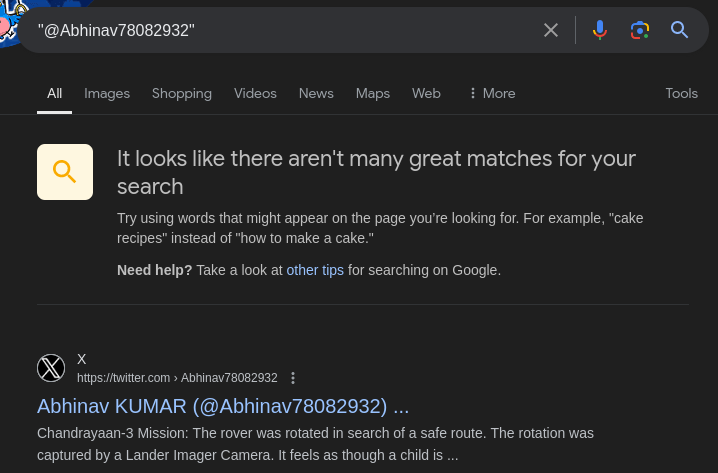
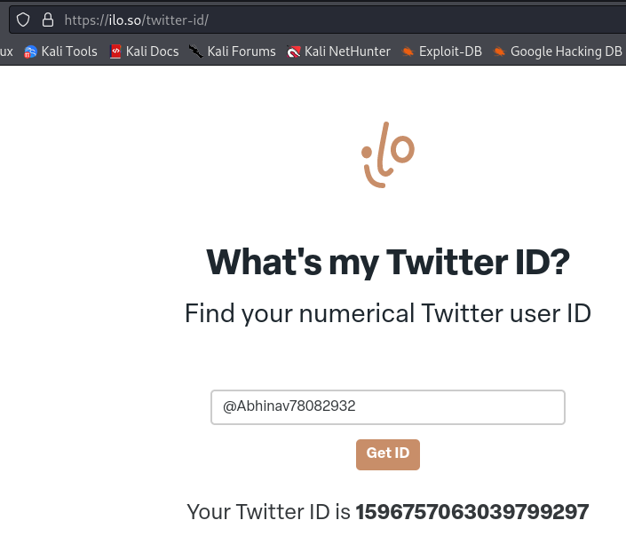

## PastebinX

* **Description:** All I need is the User ID said the boss. Help the poor employee to find the id. Flag format - `n00bz{1d_}`. If id is "hhjkh876897" then flag will be `n00bz{1d_hhjkh876897}`. Note - see Pastebin for name. 
* **Author:** NoobMaster.
## Writeup

Ok, so remember how on the first Pastebin challenge we saw a commend left by  the user [abhinav654321](https://pastebin.com/u/abhinav654321) that said `"for part 2 - @Abhinav78082932"`.  That's going to be our starting point.

 

A quick Google search shows the X profile of [Abhinav KUMAR (@Abhinav78082932)](https://x.com/Abhinav78082932), which is probably where we have to get the ID from. To get said ID, we can use multiple online tools like https://ilo.so/twitter-id/, which outputs the following result which we'll use to complete our flag.

## Flag - n00bz{1d_1596757063039799297}