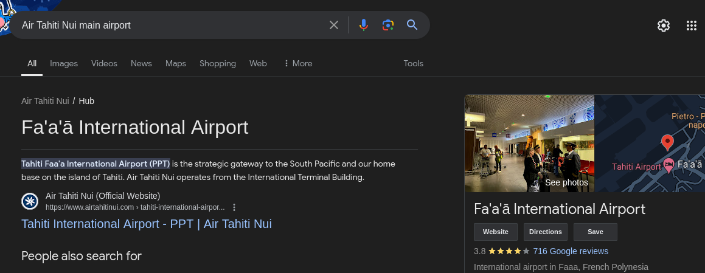

## Tail

* **Description:** Here's a picture of a plane's tail. Can you find the airline's hub (the airport where they mostly operate from). Use the three letter airport IATA code and wrap it in n00bz{}. Example: `n00bz{SFO}`. 
* **Author:** NoobMaster.

 
## Writeup

Googling for `"airline with flower logo"` immediately shows results that are very similar to the 7 petal flower logo in tail.jpg

 

One of the first results shows a [pinterest](https://co.pinterest.com/pin/150096600055453894/) post that indicates the logo belongs to `"Air Tahiti Nui"`. A quick google search for `"Air Tahiti Nui main airport"` provides us with some general information regarding this airport.

 

From the search we can get the following data:
* Airport name: Fa'a'ā International Airport.
* Location: Faaa, French Polynesia.
* IATA code: PPT.
## Flag - n00bz{PPT}