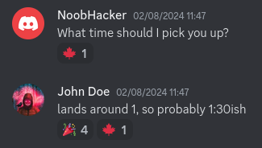
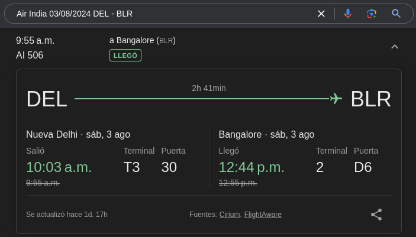

## The Gang 4

* **Description:** Can you find more information about his flight? Time to close John Doe's case one and for all! Note: Flag format: `n00bz{DateOfFlight(DD/MM/YYYY)_FlightNumber_IATAairportCodeOfDeparture_IATAairportCodeofArrival_ACTUALtimeOfDeparture_ACTUALtimeOfArrival_GateofDeparture_AirplaneModel}` Example: `n00bz{26/06/2024_AA1337_DFW_SFO_13:37_15:51_32A_AirbusA319-400}` Please use the above format to format your flag.
* **Author:** NoobMaster.
## Writeup

So, we got to the final challenge. To solve this one we'll start by reading more of the discord group chat that we previously discovered.

There's a lot of chatter but the following screenshots will highlight some of the most relevant information for this last challenge. For example, this first image heavily implies that John is in Delhi and is traveling to Bengaluru.

The second image shows that the flight's scheduled time is 9:40 a.m.

The third image indicates that the airport is named after the person depicted in the statue (`"Nadaprabhu Kempegowda Statue"`, the one we found on the previous challenge). We can also read that John said the flight date is `03/08/2024` (DD/MM,YYYY).

The fourth image implies that John's scheduled landing time is close to 1 p.m.

The fifth image confirms that John traveled via Air India.

Ok, now that we got the relevant pieces of information available on their group chat, lets organize so we can see what we have and what we need to form our flag.
* **DateOfFlight(DD/MM/YYYY):** 03/08/2024
* **FlightNumber:** Unknown.
* **IATAairportCodeOfDeparture:** Unknown but we know that John comes from Delhi.
* **IATAairportCodeofArrival:** Unknown but we know that John is going to Bengaluru.
* **ACTUALtimeOfDeparture:** Unknown but we know that the scheduled time is 9:40 a.m.
* **ACTUALtimeOfArrival:** Unknown but we know that the schedulled time is around 1:00 p.m.
* **GateofDeparture:** Unknown.
* **AirplaneModel:** Unknown.
* **Airline:** Air India.

After organizing out clues, we have some base to start but there is a lot to look for. Let's start by the easy ones, the IATA airport Codes.

So the codes of the airports are DEL and BLR. With that and the date we can look for the flight number.

 

By googling `"Air India 03/08/2024 DEL - BLR"` we can find some flight details but the hour range doesn't match the information that we have so let's keep scrolling until we see a range that fits what we are looking for.

Bingo, this one seems to match what we are looking for. From this search we can get a lot of data, the flight number is AI506, it departed at 10:03, landed at 12:44 and the gate of departure was number 30. That only leaves us with finding the airplane model, which we'll check in the official [air India website](https://www.airindia.com/in/en/manage/flight-status.html).

Finally, in the official website we can confirm that the previously found information was right and the last remaining piece of the puzzle, the aircraft model is the Airbus A350-900. Now we can put together all the information we've found and get out flag.
## Flag - n00bz{03/08/2024_AI506_DEL_BLR_10:03_12:44_30_AirbusA350-900}
